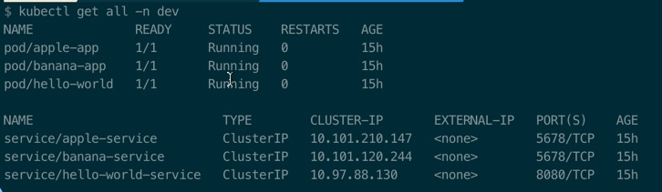
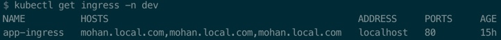

## Create a simple nginx and ingress-controller to expose PODS.

* Created this scenario on Macbook pro:
    - Install Docker for Mac: version Engine: 18.xx.x
    - Enable Kubernetes: Click on the Docker icon on the taskbar --> Preferences --> Kubernetes
    ![enable-k8s] 


* create a nginx-controller using the below command.
    ```bash
    kubectl apply -f mandatory.yaml
    ```
* Enable ingress add-on.
    ```bash
    kubectl apply -f cloud-generic.yaml
    ```
* Verify the nginx-controller pod
    ```bash
    kubectl get pods --all-namespaces -l app=ingress-nginx
    ```

### Service creation
#### Create 3 services to deploy on a namespace dev
* Create a file [ns-dev.yaml](ns-dev.yaml)
* Deploy the microservices using the configuration in micro-services.yaml
    ```bash
    $ kubectl apply -f micro-services.yaml
    ```
* Create [ingress.yaml](ingress.yaml) to route the requests to ```/hello``` ```/banana``` ```/apple```
* Deploy ```ingress rules```
    ```bash
    $ kubectl apply -f ingress.yaml
    ```
* Check the pods and ingress rule
    ```
    $ kubectl get all -n dev
    ```
    
    ```
    $ kubectl get ingress -n dev
    ```
    
* Append ```mohan.local.com``` in ```/etc/hosts```
    ```
    127.0.0.1	localhost mohan.local.com
    ```
* Verify the output
    ```
    $ curl -kv vishnu.local.com/hello

    output:
    *   Trying ::1...
    * TCP_NODELAY set
    * Connection failed
    * connect to ::1 port 80 failed: Connection refused
    *   Trying 127.0.0.1...
    * TCP_NODELAY set
    * Connected to mohan.local.com (127.0.0.1) port 80 (#0)
    > GET /hello HTTP/1.1
    > Host: mohan.local.com
    > User-Agent: curl/7.54.0
    > Accept: */*
    >
    < HTTP/1.1 200
    < Server: nginx/1.15.9
    < Date: Fri, 29 Mar 2019 20:33:41 GMT
    < Content-Type: application/json;charset=UTF-8
    < Content-Length: 18
    < Connection: keep-alive
    <
    * Connection #0 to host mohan.local.com left intact
    {"status":"hello"}%
    ```

### For Ingress Update documentation [click here](documentation/update-ingress.md)
### Ingress Custom configuration [click here](documentation/custom-configuration.md)
